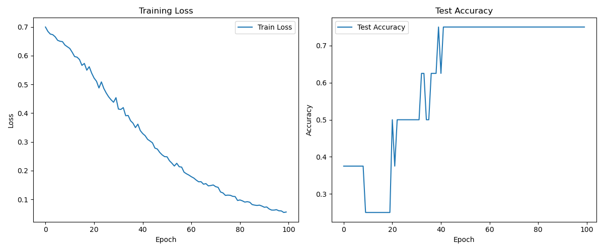
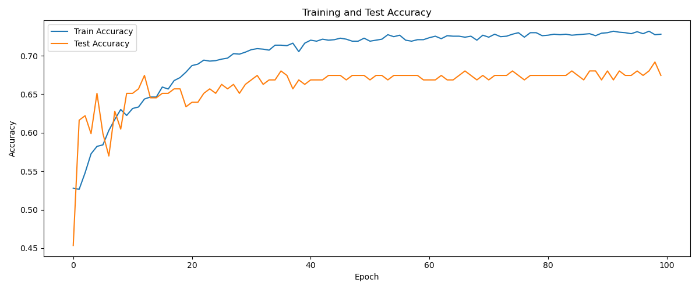

# 基于AI的明日方舟斗蛐蛐胜率预测模型(Arknights-Fighting!)

## Introduction

Arknights-Fighting是基于[明日方舟斗蛐蛐错题册](https://github.com/xinhai-ai/arknightall)且为其服务的斗蛐蛐胜率预测模型。本项目使用了该Github项目中的Monster数据集与图片模板，为了方便起见，同时使用了其源代码进行数据收集。期待[明日方舟斗蛐蛐错题册](https://github.com/xinhai-ai/arknightall)能够在UI界面上加入胜率预测功能。

**本项目实际不包含UI界面的使用说明与再次开发，仅用于数据收集和模型训练。值得注意的是，本项目未包含具体的站位和场地信息，也仅在自娱自乐模式收集数据，所以缺少若干领袖敌人。本项目不对您在B站直播间的硬币负责。**

## File Structure

- `capture/`：临时存放截图的文件夹
- `data/`：存放数据集与图片模板的文件夹
  - `data/image/`：存放斗蛐蛐图片模板的文件夹
  - `data/win-lose/`：存放斗蛐蛐胜利图片模板的文件夹
  - `data/monster.csv`：怪物编号和具体属性
- `results/`：存放模型训练数据的文件夹
  - `results/result_{datetime}.json`：以JSON格式存储的模型训练数据
- `src/`：存放源代码的文件夹，具体说明见[明日方舟斗蛐蛐错题册](https://github.com/xinhai-ai/arknightall)
- `run_dataset.py`：数据收集脚本
- `DEBUG/`：调试文件夹

## Get Started
以下是`run_dataset.py`的全局参数调试说明：

1. 确保你有mumu模拟器（虽然可以简单修改以适配其他模拟器，但是鼠鼠还得做作业），文件中的`ADB_PATH`和`MUMU_ADB_PORT`需要修改为你自己的路径和端口。
2. 由于截图与模拟器的分辨率相关，所以需要修改`CLICK_TASKS`中的任务区域。最简单的方法是使用和我一样的分辨率（2560x1440），如果你使用的是其他分辨率，可以使用`DEBUG/`文件夹中的相关文件进行测试，以获取相应的坐标。
3. `ITERATION`是进行自娱自乐模式的次数，每局正常可以收集10份数据，每局大概需要10分钟。

以下是`results/result_{datetime}.json`的参数说明：
```json
{
    "left": {
        "obj_25": 6,
        "obj_27": 14,
        "obj_43": 5
    },
    "right": {
        "obj_20": 4,
        "obj_39": 5,
        "obj_44": 3
    },
    "wl": "left"
}
```
其中，"left"和"right"分别表示左边和右边的怪物，"obj_25"、"obj_27"等是怪物的编号，数字是怪物的数量。最后的"wl"表示胜利方，"left"表示左边胜利，"right"表示右边胜利。具体编号对应的怪物信息可以在`data/monster.csv`中找到。

需要注意的是，**数据收集可能存在偏差**，比如我有一次遇到11个萨卡兹大剑手被识别为1个（11的个位数被识别为边框）。

## Train Idea

> **斗蛐蛐需要有画面感** --- 血狼破军

虽然学长说得对，但该数据显然不包括具体的站位信息，也不包括具体的场地信息。我们尽可能针对已有的数据进行训练。编号中蕴含了怪物的属性和技能信息，为了方便训练，模型还会输入怪物编号对应的属性，以使得模型更加"**Arknights-Informed**"。此外，数量信息也是不可缺少的。


比较容易想到的两个模型分别是：
- 基于特征独立加和的MLP模型：设计两个MLP，一个用于每种怪物的特征（怪物idx，数量，攻击，防御，法抗，是否法伤，范围，移速）提取，将双方的怪物独立加和，经过另一个MLP进行单标签分类。
- 基于对抗与联合关系的GNN模型：同样的道理，不过将怪物视为顶点（需要加上阵营标识以区分左右），将对抗或联合关系视为边（两种关系需要不同的边消息传递机制）。最后将顶点特征加和后经过MLP进行单标签分类。

鉴于鼠鼠的时间不太够，只做了第一个模型。最后在80个数据（10%测试集）上的测试结果如下：



数据收集还是太慢了，只能说在这个小数据集上的表现还不错。

在第三方（cannot项目，1500条数据）的数据上测试，得到效果如下：

对数据进行分析，定义大于等于4种单位为混战数据，在所有数据中占比55%，而模型预测失败的数据中，混战数据占比只有50%。这一分析支持**模型善于分析混战数据**的结论。